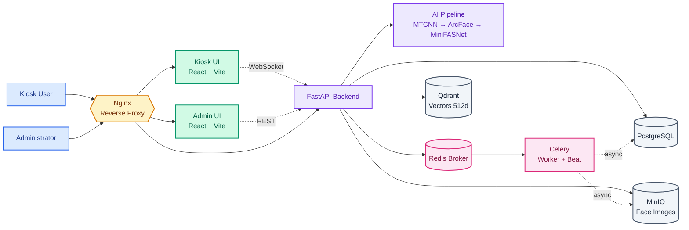

# Face Recognition System

A real-time face recognition system for employee attendance and access control. The project follows a microservices architecture and runs entirely with Docker Compose — get the system up and running with a single command.

## Key Features

- **Real-time face recognition** at the kiosk with instant results on the interface
- **Employee enrollment** by scanning multiple face angles for higher accuracy
- **Liveness detection (anti-spoofing)** to distinguish real faces from printed photos or phone screens
- **Admin dashboard** to manage employees, view access history with snapshots, and adjust system parameters
- **Two-tier access control** (Super Admin / Admin) with password reset and personal password change
- **Audit log** recording all admin actions (create/delete/change password/update settings)
- **Multi-frame consensus**: only commits a log after 3 consecutive frames agree on the same person
- **Smart gating**: detects covered face, closed eyes, face too far/close — blocks invalid frames before sending to backend
- **Soft delete employees**: preserves old check-in history, shows "Resigned" badge
- **Anti-spam logging**: 1 check-in per day per employee, ignores unknown faces
- **Dashboard drill-down**: click a stat card → detail modal by day/week
- **Health check endpoint** `/api/health` monitors the status of all 4 services in real time

## Tech Stack

| Component | Technology |
|------------|-----------|
| Backend | FastAPI (Python 3.10) |
| Frontend | React + Vite (2 apps: Kiosk & Admin) |
| Reverse proxy | Nginx |
| Relational DB | PostgreSQL |
| Vector DB | Qdrant |
| Image storage | MinIO |
| Task queue | Redis + Celery |
| Deployment | Docker Compose |

**AI Pipeline:** MTCNN (face detection) → MiniFASNet (anti-spoofing) → ArcFace (512-dim embedding) → MediaPipe FaceLandmarker (3D landmarks for fusion matching) → Qdrant (cosine similarity search) → Multi-frame consensus (3 consecutive frames with same person before committing log).

## System Architecture

The system is organized into layers:

1. **Users** access the Kiosk or Admin interface
2. **Nginx** acts as a reverse proxy, receiving and forwarding requests
3. **Frontend** renders the user and admin interfaces
4. **Backend API + AI core** handles recognition, authentication, and data storage
5. **Celery/Redis** handles background tasks such as enrollment, snapshot saving, and backup
6. **PostgreSQL, Qdrant, and MinIO** store relational data, vectors, and images respectively

The Kiosk streams camera frames to the backend via WebSocket, while the Admin panel communicates via REST API. Heavy tasks are pushed into the Redis queue for background worker processing.



## System Requirements

- **Docker Desktop** must be running before starting the system
- **Git** to clone the repository
- For GPU acceleration: machine must have an **NVIDIA GPU** with Docker GPU support enabled

## Installation & Running

### 1. Clone the repository

```bash
git clone <repo-url>
cd <project-folder>
```

### 2. Make sure Docker Desktop is running

Open Docker Desktop before running any commands. If Docker is not ready, compose will throw errors or timeout during image build.

### 3. Start the system

#### Option 1 — Standard (all machines)

```bash
docker compose up -d
```

- The system will run in **CPU** mode.
- First run may take a few minutes to build images.
- Containers will start automatically and run in the background.

#### Option 2 — Auto GPU detection (if supported)

```bash
# Windows
start.bat

# Linux / macOS
./start.sh
```

The script auto-detects whether an NVIDIA GPU and Docker GPU support are available. If compatible, the system runs in **GPU** mode; otherwise it falls back to **CPU** automatically.

### 4. Check status

To verify running containers:

```bash
docker compose ps
```

To view logs:

```bash
docker compose logs -f
```

## Accessing the Interface

| Interface | URL | Notes |
|-----------|-----|-------|
| Kiosk (recognition) | http://localhost | Used for face scanning at the kiosk |
| Admin dashboard | http://localhost:5174 | System administration panel |
| Qdrant dashboard | http://localhost:6333/dashboard | Inspect vector embeddings |
| MinIO console | http://localhost:9001 | View stored images (`minioadmin` / `minioadmin123`) |
| Health check | http://localhost/api/health | JSON status of all 4 backend services |

### Default Admin Credentials

- **Username:** `admin`
- **Password:** `admin123`

> Change the password immediately after deployment to ensure security.

> ⚠️ **REQUIRED**: Change `JWT_SECRET` (in `.env`) and the admin password before exposing the system publicly.
> The default `admin / admin123` is for **local development only**.

### Initialize / Reset Admin Account

The system **automatically creates a super admin** (`admin / admin123`) when the database is empty — on first run or after `docker compose down -v`. No manual setup needed.

To reset manually (e.g. locked out of account, or seeding sample data for testing):

```bash
docker compose exec backend python /scripts/seed_db.py
```

This script creates:
- Super admin: `admin / admin123` (if not already present)
- 4 sample employees (EMP001–EMP004) for enrollment testing

### If the page doesn't load

- Wait 1–2 minutes for all containers to finish starting up
- Make sure Docker Desktop is running
- Run `docker compose ps` to confirm all services are `Up`
- Check logs with `docker compose logs -f`

## Environment Configuration

The system **works out of the box with defaults** — creating a `.env` file is not required.

To customize the configuration, copy `.env.example` to `.env` and adjust the following:

- `JWT_SECRET` — replace with a long random string before production use
- Database and service connection strings
- Backup-related variables: `BACKUP_HOST_DIR`, `BACKUP_RETENTION_DAYS`, `BACKUP_INCLUDE_MINIO`

## Project Structure

```
.
├── backend/                # FastAPI service + AI core
│   ├── app/                # Source code (api, core, db, services, workers)
│   ├── tests/              # Pytest test suite
│   └── Dockerfile
├── cloudflare/             # Internet deployment via Cloudflare Tunnel
├── frontend-admin/         # Admin interface (React + Vite)
├── frontend-user/          # Kiosk interface (React + Vite)
├── models/                 # AI weights (best_model.pth, face_landmarker.task)
├── nginx/                  # Reverse proxy configuration
├── scripts/                # Backup utilities + offline data prep
├── secrets/                # Service account JSON (gitignored)
├── docker-compose.yml      # Standard deployment config (CPU)
├── docker-compose.gpu.yml  # Optional GPU override layer
├── start.bat / start.sh    # Auto GPU-detection startup scripts
└── .env.example            # Environment variable template
```

## Deploying to the Internet with Cloudflare Tunnel

Uses Cloudflare Tunnel instead of opening ports — **no public IP needed, no VPS required**. Run on a local machine and access over the Internet with automatic free SSL.

### Architecture

```
Internet
  │
  ▼
Cloudflare Edge (automatic SSL)
  │
  ▼  (encrypted tunnel)
cloudflared container
  │
  ▼
nginx:80 (reverse proxy)
  ├── /api/   → backend:8000
  ├── /ws/    → backend:8000 (WebSocket)
  ├── /admin/ → frontend-admin:80
  └── /       → frontend-user:80
```

---

### Step 1 — Set up Cloudflare

1. Register a free account at [cloudflare.com](https://cloudflare.com)
2. Add your domain to Cloudflare (purchase via Cloudflare or use an existing domain)
3. Install `cloudflared` on the host machine:

```bash
# Ubuntu/Debian
curl -L https://github.com/cloudflare/cloudflared/releases/latest/download/cloudflared-linux-amd64.deb -o cloudflared.deb
sudo dpkg -i cloudflared.deb

# Verify
cloudflared --version
```

---

### Step 2 — Create tunnel and get credentials

```bash
# Log in to Cloudflare (opens browser automatically)
cloudflared tunnel login

# Create the tunnel
cloudflared tunnel create face-recognition
```

The command will output:
```
Tunnel credentials written to /root/.cloudflared/<TUNNEL_ID>.json
Created tunnel face-recognition with id <TUNNEL_ID>
```

> ⚠️ **Save the `TUNNEL_ID`** — you will need it in the next steps.

---

### Step 3 — Configure the tunnel

Create `cloudflare/config.yml`:

```yaml
tunnel: <TUNNEL_ID>
credentials-file: /root/.cloudflared/<TUNNEL_ID>.json

ingress:
  # User frontend
  - hostname: face.yourdomain.com
    service: http://nginx:80

  # Admin frontend
  - hostname: admin.face.yourdomain.com
    service: http://nginx:80

  # Catch-all
  - service: http_status:404
```

> 💡 Both hostnames point to `nginx:80`. Nginx routes traffic based on **path** (`/admin/` vs `/`).

---

### Step 4 — Configure DNS on Cloudflare dashboard

Go to **Cloudflare dashboard → DNS → Add record** and add 2 CNAME entries:

| Type | Name | Target | Proxy |
|------|------|--------|-------|
| CNAME | face | `<TUNNEL_ID>.cfargotunnel.com` | ✅ ON (orange) |
| CNAME | admin.face | `<TUNNEL_ID>.cfargotunnel.com` | ✅ ON (orange) |

> ⚠️ Proxy must be **ON** — required for automatic SSL.

---

### Step 5 — Docker Compose

`cloudflared` is already declared in `docker-compose.yml`:

```yaml
cloudflared:
  image: cloudflare/cloudflared:latest
  command: tunnel --config /etc/cloudflared/config.yml run
  volumes:
    - ./cloudflare/config.yml:/etc/cloudflared/config.yml
    - ~/.cloudflared:/root/.cloudflared:ro   # directory containing credentials JSON
  depends_on:
    - nginx
  restart: unless-stopped
```

> ⚠️ The `~/.cloudflared/` directory on the host must contain the `<TUNNEL_ID>.json` file created in Step 2. **Do not commit this file to GitHub.**

---

### Step 6 — Start the system

```bash
docker compose up -d

# Check if the tunnel connected successfully
docker compose logs -f cloudflared
```

Normal output:
```
cloudflared | Registered tunnel connection connIndex=0
cloudflared | Registered tunnel connection connIndex=1
```

---

### Step 7 — Verify

```bash
# API health check
curl https://face.yourdomain.com/api/health

# User frontend
open https://face.yourdomain.com

# Admin frontend
open https://admin.face.yourdomain.com
```

---

### Security Notes

Add to `.gitignore`:
```
.cloudflared/
```

Never commit `~/.cloudflared/<TUNNEL_ID>.json` to GitHub — this file contains credentials that grant full control over the tunnel.

SSL is provided automatically by Cloudflare — **no certbot or Let's Encrypt setup required**.

---

## Automated Data Backup

The backup system is built into the backend (`backup_service.py` + `gdrive_uploader.py`).

### What gets backed up

| Component | Output file | Notes |
|-----------|-------------|-------|
| PostgreSQL | `postgres.dump` | pg_dump custom format (`-F c`) |
| Qdrant | `qdrant_face_embeddings.snapshot` | Full collection snapshot |
| MinIO | `minio/face-images/`, `minio/snapshots/` | **Off** by default |

> ⚠️ **MinIO backup is OFF by default** (`BACKUP_INCLUDE_MINIO=false`). Original images already live in the Docker volume `minio_data` — backing up the Docker volume is sufficient. Enable only when you need to copy images elsewhere.

---

### `.env` Configuration

```env
# ── Core backup ──
BACKUP_ENABLED=true
BACKUP_DIR=/backups
BACKUP_RETENTION_DAYS=14        # delete backups older than 14 days

# ── MinIO (optional) ──
BACKUP_INCLUDE_MINIO=false      # set true to backup all original images

# ── Google Drive (optional) ──
GOOGLE_DRIVE_ENABLED=false
GOOGLE_DRIVE_AUTH_MODE=oauth    # oauth | service_account
GOOGLE_DRIVE_FOLDER_ID=         # Google Drive folder ID
GOOGLE_DRIVE_OAUTH_TOKEN=./secrets/gdrive-oauth-token.json
GOOGLE_DRIVE_CREDENTIALS=./secrets/gdrive-service-account.json
```

---

### Backup output structure

```
/backups/
└── 20241201_023000/
    ├── postgres.dump                      # PostgreSQL dump
    ├── qdrant_face_embeddings.snapshot    # Qdrant snapshot
    ├── minio/                             # only if BACKUP_INCLUDE_MINIO=true
    │   ├── face-images/
    │   └── snapshots/
    └── manifest.json                      # metadata: timestamp, sizes
```

If `GOOGLE_DRIVE_ENABLED=true`, the directory is compressed into `facerecog_backup_<timestamp>.tar.gz` and uploaded to Google Drive. Backups older than `BACKUP_RETENTION_DAYS` days are automatically deleted both locally and on Drive.

---

### Trigger a manual backup

Backup is not yet scheduled automatically — run manually when needed:

```bash
docker compose exec backend python -c "
from app.services.backup_service import run_full_backup
import json
result = run_full_backup()
print(json.dumps(result, indent=2, ensure_ascii=False))
"
```

Expected output on success:

```json
{
  "success": true,
  "backup_dir": "/backups/20241201_023000",
  "components": {
    "postgres": { "file": "postgres.dump", "size_bytes": 524288 },
    "qdrant":   { "file": "qdrant_face_embeddings.snapshot", "size_bytes": 1048576 },
    "minio":    { "skipped": true, "note": "Images are stored in Docker volume minio_data" }
  },
  "old_backups_removed": 0,
  "gdrive": { "success": true, "skipped": true, "reason": "gdrive_disabled" }
}
```

---

### Upload to Google Drive (optional)

Two authentication modes are supported:

#### Option A — OAuth (personal Gmail, recommended)

```bash
# Run once to authenticate and generate the token file
python scripts/gdrive_oauth_setup.py
```

`.env` configuration:
```env
GOOGLE_DRIVE_ENABLED=true
GOOGLE_DRIVE_AUTH_MODE=oauth
GOOGLE_DRIVE_OAUTH_TOKEN=./secrets/gdrive-oauth-token.json
GOOGLE_DRIVE_FOLDER_ID=<Google_Drive_folder_ID>
```

`secrets/gdrive-oauth-token.json` is generated after running `gdrive_oauth_setup.py`. **Do not commit this file to GitHub.**

#### Option B — Service Account (Google Workspace)

Use when you have Google Workspace with a Shared Drive.

`.env` configuration:
```env
GOOGLE_DRIVE_ENABLED=true
GOOGLE_DRIVE_AUTH_MODE=service_account
GOOGLE_DRIVE_CREDENTIALS=./secrets/gdrive-service-account.json
GOOGLE_DRIVE_FOLDER_ID=<Shared_Drive_ID>
```

> ⚠️ Using a Service Account with a **personal** Google Drive will result in a `storageQuotaExceeded` error (quota = 0). Use a Shared Drive or switch to OAuth instead.

---

### Scheduled tasks (Celery Beat)

| Task | Schedule | Function |
|------|----------|----------|
| `cleanup_task` | 2:00 AM daily | Deletes check-in snapshot images older than 30 days from MinIO |
| `daily_report_task` | 11:59 PM daily | Aggregates attendance count for the day |

---

### Restore procedure

```bash
# ── Restore PostgreSQL ──
# Step 1: copy dump file into the container
docker cp ./backups/20241201_023000/postgres.dump \
  $(docker compose ps -q postgres):/tmp/postgres.dump

# Step 2: restore
docker compose exec postgres pg_restore \
  -U admin -d facerecog -F c /tmp/postgres.dump

# ── Restore Qdrant ──
curl -X POST \
  "http://localhost:6333/collections/face_embeddings/snapshots/upload" \
  -H "Content-Type: multipart/form-data" \
  -F "snapshot=@./backups/20241201_023000/qdrant_face_embeddings.snapshot"
```

---

## Stopping the System

```bash
docker compose down
```

To also remove all stored data (databases, images, volumes):

```bash
docker compose down -v
```

## Notes

- The database schema is initialized automatically on first run — no manual setup required
- GPU mode is an optional performance boost; all features work fully in CPU mode
- Change `JWT_SECRET` and the admin password before deploying to a production environment