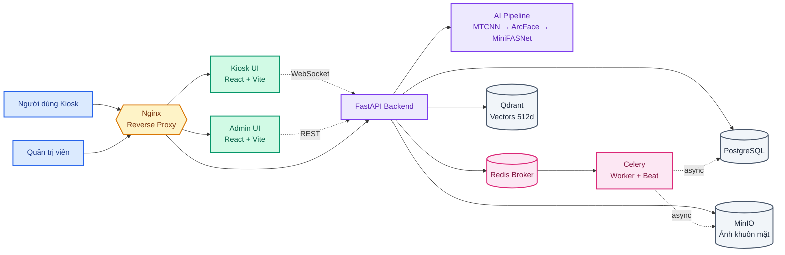

# Hệ Thống Nhận Diện Khuôn Mặt

Hệ thống điểm danh và kiểm soát ra vào bằng nhận diện khuôn mặt thời gian thực. Dự án được triển khai theo mô hình microservices và chạy toàn bộ bằng Docker Compose, giúp bạn khởi động hệ thống chỉ với một lệnh.

## Tính năng chính

- **Nhận diện khuôn mặt thời gian thực** tại kiosk, hiển thị kết quả ngay trên giao diện
- **Đăng ký nhân viên** bằng cách quét nhiều góc khuôn mặt để tăng độ chính xác
- **Chống giả mạo (liveness)** để phân biệt người thật với ảnh in hoặc màn hình điện thoại
- **Trang quản trị** để quản lý nhân viên, xem lịch sử ra vào kèm ảnh và điều chỉnh tham số hệ thống
- **Phân quyền 2 cấp** (Super Admin / Admin) với reset mật khẩu và đổi mật khẩu cá nhân
- **Nhật ký hoạt động** ghi lại các thao tác quản trị (tạo/xóa/đổi mật khẩu/cập nhật cài đặt)
- **Multi-frame consensus**: chỉ ghi log khi 3 frame liên tiếp đồng thuận
- **Gating thông minh**: phát hiện che mặt, nhắm mắt, mặt quá xa/gần — chặn frame không hợp lệ trước khi gửi backend
- **Soft delete nhân viên**: giữ lịch sử check-in cũ, hiện badge "Đã nghỉ việc"
- **Chống spam log**: 1 check-in/ngày/nhân viên, bỏ qua ghi log với người lạ
- **Dashboard drill-down**: click thẻ thống kê → modal chi tiết theo ngày/tuần
- **Health check endpoint** `/api/health` kiểm tra trạng thái 4 service realtime

## Công nghệ sử dụng

| Thành phần | Công nghệ |
|------------|-----------|
| Backend | FastAPI (Python 3.10) |
| Frontend | React + Vite (2 ứng dụng: Kiosk & Admin) |
| Reverse proxy | Nginx |
| CSDL quan hệ | PostgreSQL |
| CSDL vector | Qdrant |
| Lưu trữ ảnh | MinIO |
| Hàng đợi tác vụ | Redis + Celery |
| Triển khai | Docker Compose |

**Pipeline AI:** MTCNN (phát hiện mặt) → MiniFASNet (chống giả mạo) → ArcFace (embedding 512 chiều) → MediaPipe FaceLandmarker (landmark 3D cho fusion matching) → Qdrant (cosine similarity search) → Multi-frame consensus (3 frame liên tiếp cùng person mới commit log).

## Kiến trúc hệ thống

Hệ thống được tổ chức theo tầng:

1. **Người dùng** truy cập vào giao diện Kiosk hoặc Admin
2. **Nginx** làm reverse proxy, nhận yêu cầu và chuyển tiếp
3. **Frontend** hiển thị giao diện người dùng và quản trị
4. **Backend API + lõi AI** xử lý nhận diện, xác thực và lưu trữ dữ liệu
5. **Celery/Redis** xử lý các tác vụ nền như đăng ký, lưu snapshot và backup
6. **PostgreSQL, Qdrant và MinIO** lưu trữ dữ liệu quan hệ, vector và ảnh

Kiosk gửi luồng camera tới backend qua WebSocket, còn trang quản trị gọi API qua REST. Các tác vụ nặng được đẩy vào hàng đợi Redis để worker xử lý nền.



## Yêu cầu hệ thống

- **Docker Desktop** phải được mở trước khi chạy
- **Git** để clone repository
- Nếu muốn dùng GPU: máy phải có **NVIDIA GPU** và Docker hỗ trợ GPU

## Cài đặt & chạy

### 1. Clone dự án

```bash
git clone <repo-url>
cd <ten-thu-muc>
```

### 2. Đảm bảo Docker Desktop đang chạy

Mở Docker Desktop trước khi thực hiện lệnh. Nếu Docker chưa sẵn sàng, compose sẽ báo lỗi hoặc bị timeout khi build image.

### 3. Chạy hệ thống

#### Cách 1 — Chạy tiêu chuẩn (tất cả máy)

```bash
docker compose up -d
```

- Hệ thống sẽ chạy ở chế độ **CPU**.
- Lần chạy đầu tiên có thể mất vài phút do build image.
- Các container sẽ được khởi động tự động và chạy nền.

#### Cách 2 — Tự động dùng GPU (nếu máy hỗ trợ)

```bash
# Windows
start.bat

# Linux / macOS
./start.sh
```

Script sẽ tự kiểm tra GPU NVIDIA và Docker hỗ trợ GPU. Nếu phù hợp, hệ thống sẽ chạy ở chế độ **GPU**; nếu không, sẽ fallback về **CPU** tự động.

### 4. Kiểm tra trạng thái

Nếu muốn kiểm tra container đang chạy:

```bash
docker compose ps
```

Nếu cần xem log:

```bash
docker compose logs -f
```

## Truy cập giao diện

| Giao diện | Địa chỉ | Ghi chú |
|-----------|---------|--------|
| Kiosk (nhận diện) | http://localhost | Dùng cho quét khuôn mặt tại kiosk |
| Quản trị (Admin) | http://localhost:5174 | Trang quản trị hệ thống |
| Qdrant dashboard | http://localhost:6333/dashboard | Xem vector embeddings |
| MinIO console | http://localhost:9001 | Xem ảnh đã lưu (`minioadmin` / `minioadmin123`) |
| Health check | http://localhost/api/health | JSON trạng thái 4 service backend |

### Tài khoản quản trị mặc định

- **Tên đăng nhập:** `admin`
- **Mật khẩu:** `admin123`

> Nên đổi mật khẩu ngay sau khi triển khai để đảm bảo an toàn.

> ⚠️ **BẮT BUỘC** đổi `JWT_SECRET` (`.env`) và mật khẩu admin trước khi public hệ thống.
> Mặc định `admin / admin123` CHỈ dành cho local development.

### Khởi tạo / Reset tài khoản admin

Hệ thống **tự động tạo super admin** (`admin / admin123`) khi database rỗng — lần đầu chạy hoặc sau `docker compose down -v`. Bạn KHÔNG cần làm gì thêm.

Nếu muốn reset thủ công (vd: bị khóa tài khoản, hoặc seed dữ liệu mẫu để test):

```bash
docker compose exec backend python /scripts/seed_db.py
```

Script này tạo:
- Super admin: `admin / admin123` (nếu chưa có)
- 4 nhân viên mẫu (EMP001–EMP004) cho test enrollment

### Nếu không mở được trang

- Đợi 1–2 phút để các container khởi động xong
- Kiểm tra lại Docker Desktop đã chạy
- Chạy `docker compose ps` để xác nhận các service đang `Up`
- Xem log bằng `docker compose logs -f`

## Cấu hình môi trường

Hệ thống **có thể chạy ngay với mặc định**, không bắt buộc tạo `.env`.

Nếu bạn muốn tùy chỉnh cấu hình, hãy sao chép `.env.example` thành `.env` và chỉnh các biến sau:

- `JWT_SECRET` — nên đổi sang chuỗi ngẫu nhiên dài trước khi dùng thật
- Các thông tin kết nối CSDL và dịch vụ khác
- Các biến liên quan đến backup như `BACKUP_HOST_DIR`, `BACKUP_RETENTION_DAYS`, `BACKUP_INCLUDE_MINIO`

## Triển khai ra Internet

Hệ thống tích hợp **Cloudflare Tunnel** (service `cloudflared`) để expose Kiosk + Admin ra Internet **không cần mở port public**, SSL miễn phí tự động.

### Cài đặt nhanh

1. **Tạo tunnel** trên Cloudflare Zero Trust → Networks → Tunnels → copy token
2. **Thêm vào `.env`**:
```env
CLOUDFLARED_TOKEN=<token-từ-Cloudflare>
```
3. **Cấu hình route** trong Cloudflare dashboard:
   - `kiosk.your-domain.com` → `http://nginx:80`
   - `admin.your-domain.com` → `http://frontend-admin:5174`
4. **Khởi động**:
```bash
docker compose up -d cloudflared
```

Cloudflare tự cấp SSL Let's Encrypt — không cần config certbot.

> Tip: dùng domain con (subdomain) bạn đã add vào Cloudflare. Nếu chưa có domain, bạn có thể test bằng Cloudflare Quick Tunnel (random URL `.trycloudflare.com`).

## Cấu trúc dự án

```
.
├── backend/                # Dịch vụ FastAPI + lõi AI
│   ├── app/                # Source code (api, core, db, services, workers)
│   ├── tests/              # Pytest test suite
│   └── Dockerfile
├── cloudflare              # Triển khai lên Internet bằng Cloudflare
├── frontend-admin/         # Giao diện quản trị (React + Vite)
├── frontend-user/          # Giao diện Kiosk (React + Vite)
├── models/                 # Trọng số AI (best_model.pth, face_landmarker.task)
├── nginx/                  # Cấu hình reverse proxy
├── scripts/                # Backup utilities + offline data prep
├── secrets/                # Service account JSON (gitignored)
├── docker-compose.yml      # Cấu hình triển khai (CPU)
├── docker-compose.gpu.yml  # Lớp phủ tùy chọn cho GPU
├── start.bat / start.sh    # Script khởi động tự dò GPU
└── .env.example            # Mẫu biến môi trường
```

## Sao lưu dữ liệu định kỳ

Hệ thống tự động tạo backup vào lúc **03:00 mỗi ngày** thông qua Celery Beat, sau đó chạy tác vụ dọn snapshot vào lúc **02:00**.

### Nội dung backup

| Thành phần | Nội dung backup |
|------------|-----------------|
| PostgreSQL | `postgres.dump` (pg_dump custom format) |
| Qdrant | Snapshot collection embedding |
| MinIO | Toàn bộ bucket ảnh khuôn mặt + snapshot |

### Vị trí lưu trữ

Backup được lưu trên máy host theo biến `BACKUP_HOST_DIR`. Mặc định là `./backups` trong repo.

```
<BACKUP_HOST_DIR>/
  20260521_030000/
    manifest.json
    postgres.dump
    qdrant_face_embeddings.snapshot
    minio/
      face-images/...
      snapshots/...
```

### Tùy chỉnh backup

Bạn có thể chỉnh các biến môi trường sau trong `.env`:

- `BACKUP_ENABLED` — bật/tắt backup (mặc định `true`)
- `BACKUP_HOST_DIR` — thư mục lưu backup trên máy host (mặc định `./backups`)
- `BACKUP_DIR` — đường dẫn trong container (mặc định `/backups`)
- `BACKUP_RETENTION_DAYS` — số ngày giữ bản backup (khuyến nghị `3`–`7` nếu ổ đĩa hạn chế)
- `BACKUP_INCLUDE_MINIO` — `false` để không copy ảnh vào backup, `true` để sao chép đầy đủ ảnh

### Chạy backup ngay

```bash
docker compose exec worker celery -A app.workers.celery_tasks call backup_task
# hoặc

docker compose exec worker python /scripts/run_backup.py
```

### Khôi phục từ backup

> Nên dừng traffic API trước khi khôi phục để tránh xung đột dữ liệu.

```bash
docker compose exec worker python /scripts/restore_backup.py /backups/20260521_030000 -y
```

### Xóa backup thủ công

Trên Windows, bạn có thể xóa hẳn thư mục backup hoặc xóa toàn bộ:

```powershell
Remove-Item -Recurse -Force .\backups\*
```

### Backup lên Google Drive

Nếu muốn sao lưu ngoài máy, có thể upload tự động file `facerecog_backup_*.tar.gz` lên Google Drive sau mỗi lần backup local.

1. Tạo Service Account và bật Drive API trên Google Cloud
2. Chia sẻ folder Drive cho email của Service Account (Editor)
3. Đặt JSON vào `secrets/gdrive-service-account.json`
4. Cấu hình `.env`:
   - `GOOGLE_DRIVE_ENABLED=true`
   - `GOOGLE_DRIVE_FOLDER_ID=...`

## Dừng hệ thống

```bash
docker compose down
```

Nếu muốn xóa luôn dữ liệu đã lưu (CSDL, ảnh, volume), hãy dùng:

```bash
docker compose down -v
```

## Ghi chú

- CSDL tự khởi tạo cấu trúc bảng ở lần chạy đầu tiên, không cần bước thiết lập thủ công
- Chế độ GPU chỉ là tùy chọn tăng tốc; mọi chức năng vẫn hoạt động đầy đủ ở chế độ CPU
- Nên đổi `JWT_SECRET` và mật khẩu admin trước khi đưa hệ thống vào môi trường thật
