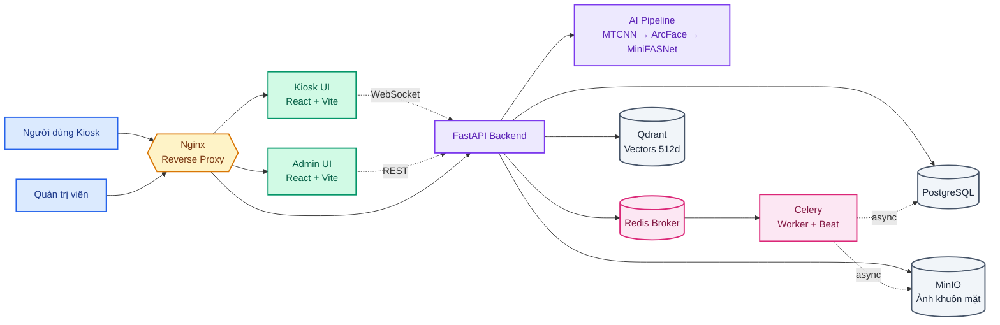

# Hệ Thống Nhận Diện Khuôn Mặt

Hệ thống điểm danh và kiểm soát ra vào bằng nhận diện khuôn mặt thời gian thực. Dự án được triển khai theo mô hình microservices và chạy toàn bộ bằng Docker Compose, giúp bạn khởi động hệ thống chỉ với một lệnh.

## Tính năng chính

- **Nhận diện khuôn mặt thời gian thực** tại kiosk, hiển thị kết quả ngay trên giao diện
- **Đăng ký nhân viên** bằng cách quét nhiều góc khuôn mặt để tăng độ chính xác
- **Chống giả mạo (liveness)** để phân biệt người thật với ảnh in hoặc màn hình điện thoại
- **Trang quản trị** để quản lý nhân viên, xem lịch sử ra vào kèm ảnh và điều chỉnh tham số hệ thống
- **Phân quyền 2 cấp** (Super Admin / Admin) với reset mật khẩu và đổi mật khẩu cá nhân
- **Nhật ký hoạt động** ghi lại các thao tác quản trị (tạo/xóa/đổi mật khẩu/cập nhật cài đặt)
- **Multi-frame consensus**: chỉ ghi log khi 3 frame liên tiếp đồng thuận
- **Gating thông minh**: phát hiện che mặt, nhắm mắt, mặt quá xa/gần — chặn frame không hợp lệ trước khi gửi backend
- **Soft delete nhân viên**: giữ lịch sử check-in cũ, hiện badge "Đã nghỉ việc"
- **Chống spam log**: 1 check-in/ngày/nhân viên, bỏ qua ghi log với người lạ
- **Dashboard drill-down**: click thẻ thống kê → modal chi tiết theo ngày/tuần
- **Health check endpoint** `/api/health` kiểm tra trạng thái 4 service realtime

## Công nghệ sử dụng

| Thành phần | Công nghệ |
|------------|-----------|
| Backend | FastAPI (Python 3.10) |
| Frontend | React + Vite (2 ứng dụng: Kiosk & Admin) |
| Reverse proxy | Nginx |
| CSDL quan hệ | PostgreSQL |
| CSDL vector | Qdrant |
| Lưu trữ ảnh | MinIO |
| Hàng đợi tác vụ | Redis + Celery |
| Triển khai | Docker Compose |

**Pipeline AI:** MTCNN (phát hiện mặt) → MiniFASNet (chống giả mạo) → ArcFace (embedding 512 chiều) → MediaPipe FaceLandmarker (landmark 3D cho fusion matching) → Qdrant (cosine similarity search) → Multi-frame consensus (3 frame liên tiếp cùng person mới commit log).

## Kiến trúc hệ thống

Hệ thống được tổ chức theo tầng:

1. **Người dùng** truy cập vào giao diện Kiosk hoặc Admin
2. **Nginx** làm reverse proxy, nhận yêu cầu và chuyển tiếp
3. **Frontend** hiển thị giao diện người dùng và quản trị
4. **Backend API + lõi AI** xử lý nhận diện, xác thực và lưu trữ dữ liệu
5. **Celery/Redis** xử lý các tác vụ nền như đăng ký, lưu snapshot và backup
6. **PostgreSQL, Qdrant và MinIO** lưu trữ dữ liệu quan hệ, vector và ảnh

Kiosk gửi luồng camera tới backend qua WebSocket, còn trang quản trị gọi API qua REST. Các tác vụ nặng được đẩy vào hàng đợi Redis để worker xử lý nền.



## Yêu cầu hệ thống

- **Docker Desktop** phải được mở trước khi chạy
- **Git** để clone repository
- Nếu muốn dùng GPU: máy phải có **NVIDIA GPU** và Docker hỗ trợ GPU

## Cài đặt & chạy

### 1. Clone dự án

```bash
git clone <repo-url>
cd <ten-thu-muc>
```

### 2. Đảm bảo Docker Desktop đang chạy

Mở Docker Desktop trước khi thực hiện lệnh. Nếu Docker chưa sẵn sàng, compose sẽ báo lỗi hoặc bị timeout khi build image.

### 3. Chạy hệ thống

#### Cách 1 — Chạy tiêu chuẩn (tất cả máy)

```bash
docker compose up -d
```

- Hệ thống sẽ chạy ở chế độ **CPU**.
- Lần chạy đầu tiên có thể mất vài phút do build image.
- Các container sẽ được khởi động tự động và chạy nền.

#### Cách 2 — Tự động dùng GPU (nếu máy hỗ trợ)

```bash
# Windows
start.bat

# Linux / macOS
./start.sh
```

Script sẽ tự kiểm tra GPU NVIDIA và Docker hỗ trợ GPU. Nếu phù hợp, hệ thống sẽ chạy ở chế độ **GPU**; nếu không, sẽ fallback về **CPU** tự động.

### 4. Kiểm tra trạng thái

Nếu muốn kiểm tra container đang chạy:

```bash
docker compose ps
```

Nếu cần xem log:

```bash
docker compose logs -f
```

## Truy cập giao diện

| Giao diện | Địa chỉ | Ghi chú |
|-----------|---------|--------|
| Kiosk (nhận diện) | http://localhost | Dùng cho quét khuôn mặt tại kiosk |
| Quản trị (Admin) | http://localhost:5174 | Trang quản trị hệ thống |
| Qdrant dashboard | http://localhost:6333/dashboard | Xem vector embeddings |
| MinIO console | http://localhost:9001 | Xem ảnh đã lưu (`minioadmin` / `minioadmin123`) |
| Health check | http://localhost/api/health | JSON trạng thái 4 service backend |

### Tài khoản quản trị mặc định

- **Tên đăng nhập:** `admin`
- **Mật khẩu:** `admin123`

> Nên đổi mật khẩu ngay sau khi triển khai để đảm bảo an toàn.

> ⚠️ **BẮT BUỘC** đổi `JWT_SECRET` (`.env`) và mật khẩu admin trước khi public hệ thống.
> Mặc định `admin / admin123` CHỈ dành cho local development.

### Khởi tạo / Reset tài khoản admin

Hệ thống **tự động tạo super admin** (`admin / admin123`) khi database rỗng — lần đầu chạy hoặc sau `docker compose down -v`. Bạn KHÔNG cần làm gì thêm.

Nếu muốn reset thủ công (vd: bị khóa tài khoản, hoặc seed dữ liệu mẫu để test):

```bash
docker compose exec backend python /scripts/seed_db.py
```

Script này tạo:
- Super admin: `admin / admin123` (nếu chưa có)
- 4 nhân viên mẫu (EMP001–EMP004) cho test enrollment

### Nếu không mở được trang

- Đợi 1–2 phút để các container khởi động xong
- Kiểm tra lại Docker Desktop đã chạy
- Chạy `docker compose ps` để xác nhận các service đang `Up`
- Xem log bằng `docker compose logs -f`

## Cấu hình môi trường

Hệ thống **có thể chạy ngay với mặc định**, không bắt buộc tạo `.env`.

Nếu bạn muốn tùy chỉnh cấu hình, hãy sao chép `.env.example` thành `.env` và chỉnh các biến sau:

- `JWT_SECRET` — nên đổi sang chuỗi ngẫu nhiên dài trước khi dùng thật
- Các thông tin kết nối CSDL và dịch vụ khác
- Các biến liên quan đến backup như `BACKUP_HOST_DIR`, `BACKUP_RETENTION_DAYS`, `BACKUP_INCLUDE_MINIO`

## Cấu trúc dự án

```
.
├── backend/                # Dịch vụ FastAPI + lõi AI
│   ├── app/                # Source code (api, core, db, services, workers)
│   ├── tests/              # Pytest test suite
│   └── Dockerfile
├── cloudflare              # Triển khai lên Internet bằng Cloudflare
├── frontend-admin/         # Giao diện quản trị (React + Vite)
├── frontend-user/          # Giao diện Kiosk (React + Vite)
├── models/                 # Trọng số AI (best_model.pth, face_landmarker.task)
├── nginx/                  # Cấu hình reverse proxy
├── scripts/                # Backup utilities + offline data prep
├── secrets/                # Service account JSON (gitignored)
├── docker-compose.yml      # Cấu hình triển khai (CPU)
├── docker-compose.gpu.yml  # Lớp phủ tùy chọn cho GPU
├── start.bat / start.sh    # Script khởi động tự dò GPU
└── .env.example            # Mẫu biến môi trường
```

## Triển khai ra Internet với Cloudflare Tunnel 

Dùng Cloudflare Tunnel thay vì mở port — **không cần public IP, không cần VPS**, chạy trên máy local vẫn truy cập được qua Internet với SSL miễn phí.

### Kiến trúc

```
Internet
  │
  ▼
Cloudflare Edge (SSL tự động)
  │
  ▼  (qua tunnel mã hóa)
cloudflared container
  │
  ▼
nginx:80 (reverse proxy)
  ├── /api/  → backend:8000
  ├── /ws/   → backend:8000 (WebSocket)
  ├── /admin/→ frontend-admin:80
  └── /      → frontend-user:80
```

---

### Bước 1 — Chuẩn bị Cloudflare

1. Đăng ký tài khoản tại [cloudflare.com](https://cloudflare.com) (miễn phí)
2. Thêm domain vào Cloudflare (mua tại Cloudflare hoặc dùng domain có sẵn)
3. Cài `cloudflared` trên máy host:

```bash
# Ubuntu/Debian
curl -L https://github.com/cloudflare/cloudflared/releases/latest/download/cloudflared-linux-amd64.deb -o cloudflared.deb
sudo dpkg -i cloudflared.deb

# Kiểm tra
cloudflared --version
```

---

### Bước 2 — Tạo tunnel và lấy credentials

```bash
# Đăng nhập Cloudflare (mở browser tự động)
cloudflared tunnel login

# Tạo tunnel
cloudflared tunnel create face-recognition
```

Lệnh tạo tunnel sẽ in ra:
```
Tunnel credentials written to /root/.cloudflared/<TUNNEL_ID>.json
Created tunnel face-recognition with id <TUNNEL_ID>
```

> ⚠️ **Lưu lại `TUNNEL_ID`** — cần dùng ở bước tiếp theo.

---

### Bước 3 — Cấu hình tunnel

Tạo file `cloudflare/config.yml`:

```yaml
tunnel: <TUNNEL_ID>
credentials-file: /root/.cloudflared/<TUNNEL_ID>.json

ingress:
  # User frontend
  - hostname: face.yourdomain.com
    service: http://nginx:80

  # Admin frontend
  - hostname: admin.face.yourdomain.com
    service: http://nginx:80

  # Catch-all
  - service: http_status:404
```

> 💡 Cả 2 hostname đều trỏ về `nginx:80`. Nginx sẽ phân route dựa trên **path** (`/admin/` vs `/`).

---

### Bước 4 — Cấu hình DNS trên Cloudflare dashboard

Vào **Cloudflare dashboard → DNS → Add record**, thêm 2 CNAME:

| Type | Name | Target | Proxy |
|---|---|---|---|
| CNAME | face | `<TUNNEL_ID>.cfargotunnel.com` |  ON (màu cam) |
| CNAME | admin.face | `<TUNNEL_ID>.cfargotunnel.com` |  ON (màu cam) |

> ⚠️ Proxy phải **ON** — bắt buộc để có SSL tự động.

---

### Bước 5 — Docker Compose

`cloudflared` đã được khai báo trong `docker-compose.yml`:

```yaml
cloudflared:
  image: cloudflare/cloudflared:latest
  command: tunnel --config /etc/cloudflared/config.yml run
  volumes:
    - ./cloudflare/config.yml:/etc/cloudflared/config.yml
    - ~/.cloudflared:/root/.cloudflared:ro   # thư mục chứa credentials JSON
  depends_on:
    - nginx
  restart: unless-stopped
```

> ⚠️ Thư mục `~/.cloudflared/` trên máy host phải chứa file `<TUNNEL_ID>.json` (được tạo ở Bước 2). File này **không commit lên GitHub**.

---

### Bước 6 — Khởi động

```bash
docker compose up -d

# Kiểm tra tunnel đã kết nối chưa
docker compose logs -f cloudflared
```

Log bình thường:
```
cloudflared | Registered tunnel connection connIndex=0
cloudflared | Registered tunnel connection connIndex=1
```

---

### Bước 7 — Kiểm tra

```bash
# API health check
curl https://face.yourdomain.com/api/health

# User frontend
open https://face.yourdomain.com

# Admin frontend
open https://admin.face.yourdomain.com
```

---

### Lưu ý bảo mật

Thêm vào `.gitignore`:
```
.cloudflared/
```

Không commit `~/.cloudflared/<TUNNEL_ID>.json` lên GitHub — file này chứa credentials cho phép điều khiển tunnel.

SSL được Cloudflare cung cấp tự động — **không cần cài certbot hay Let's Encrypt**.


## Sao lưu dữ liệu định kỳ

Hệ thống backup tự động được tích hợp sẵn trong backend, chạy hàng ngày qua Celery Beat.

### Những gì được backup

| Thành phần | Nội dung | Bắt buộc |
|---|---|---|
| PostgreSQL | Toàn bộ schema + data (employees, logs, admins) |  Luôn backup |
| Qdrant | Snapshot collection `face_embeddings` (embeddings 512D) | = Luôn backup |
| MinIO | Bucket `face-images` + `snapshots` (ảnh gốc) |  Tùy cấu hình |

> ⚠️ **MinIO backup mặc định TẮT** (`BACKUP_INCLUDE_MINIO=false`). Lý do: ảnh gốc đã được lưu trong Docker volume `minio_data` — backup volume Docker là đủ. Bật khi cần backup ảnh sang nơi khác.

---

### Cấu hình

Thêm vào `.env`:

```env
# ── Backup cơ bản ──
BACKUP_ENABLED=true
BACKUP_DIR=/app/backups
BACKUP_RETENTION_DAYS=30      # giữ backup tối đa 30 ngày

# ── MinIO backup (tùy chọn) ──
BACKUP_INCLUDE_MINIO=false    # true nếu muốn backup ảnh gốc

# ── Google Drive upload (tùy chọn) ──
GDRIVE_ENABLED=false
GDRIVE_AUTH_MODE=oauth        # oauth | service_account
GDRIVE_FOLDER_ID=             # ID folder trên Google Drive
```

---

### Lịch chạy

| Task | Thời gian | Chức năng |
|---|---|---|
| `full_backup_task` | 2:00 AM hàng ngày | Backup Postgres + Qdrant + MinIO (nếu bật) |
| `cleanup_task` | 2:00 AM hàng ngày | Xóa snapshot ảnh cũ hơn 30 ngày trong MinIO |
| `daily_report_task` | 23:59 hàng ngày | Tổng hợp chấm công trong ngày |

---

### Upload lên Google Drive (tùy chọn)

Hỗ trợ 2 chế độ xác thực:

#### Cách A — OAuth (Gmail cá nhân, khuyến nghị)

Dùng khi không có Google Workspace. Backup lưu vào Google Drive cá nhân.

```bash
# Chạy 1 lần để lấy OAuth token
python scripts/gdrive_oauth_setup.py
```

Cấu hình `.env`:
```env
GDRIVE_ENABLED=true
GDRIVE_AUTH_MODE=oauth
GDRIVE_OAUTH_TOKEN_PATH=./secrets/gdrive_oauth_token.json
GDRIVE_FOLDER_ID=<ID_folder_Google_Drive>
```

#### Cách B — Service Account (Google Workspace)

Dùng khi có Google Workspace với Shared Drive.

```bash
# Tạo Service Account tại Google Cloud Console
# Tải file JSON credentials về
```

Cấu hình `.env`:
```env
GDRIVE_ENABLED=true
GDRIVE_AUTH_MODE=service_account
GDRIVE_CREDENTIALS_PATH=./secrets/gdrive-service-account.json
GDRIVE_FOLDER_ID=<ID_Shared_Drive>
```

> ⚠️ **Lưu ý**: Service Account với Google Drive cá nhân sẽ báo lỗi quota (quota = 0). Phải dùng Shared Drive hoặc chuyển sang OAuth.

---

### Kết quả backup

Mỗi lần backup tạo ra 1 thư mục theo timestamp:

```
/app/backups/
└── 20241201_020000/
    ├── postgres.dump              # pg_dump format custom (-Fc)
    ├── qdrant_face_embeddings.snapshot   # Qdrant snapshot
    ├── minio/                     # (chỉ có nếu BACKUP_INCLUDE_MINIO=true)
    │   ├── face-images/
    │   └── snapshots/
    └── manifest.json              # metadata: thời gian, kích thước, cấu hình
```

Nếu `GDRIVE_ENABLED=true`, thư mục được nén thành `.tar.gz` và upload lên Google Drive. Backup cũ hơn `BACKUP_RETENTION_DAYS` ngày tự động bị xóa cả local lẫn Drive.

---

### Restore

```bash
# Restore PostgreSQL
docker compose exec postgres pg_restore \
  -U admin -d facerecog -Fc \
  /path/to/postgres.dump

# Restore Qdrant
curl -X POST "http://localhost:6333/collections/face_embeddings/snapshots/upload" \
  -H "Content-Type: multipart/form-data" \
  -F "snapshot=@/path/to/qdrant_face_embeddings.snapshot"
```

---

### Kích hoạt backup thủ công

```bash
# Chạy backup ngay lập tức (không cần chờ 2AM)
curl -X POST http://localhost:8000/api/admin/backup/run \
  -H "Authorization: Bearer <token>"
```


## Dừng hệ thống

```bash
docker compose down
```

Nếu muốn xóa luôn dữ liệu đã lưu (CSDL, ảnh, volume), hãy dùng:

```bash
docker compose down -v
```

## Ghi chú

- CSDL tự khởi tạo cấu trúc bảng ở lần chạy đầu tiên, không cần bước thiết lập thủ công
- Chế độ GPU chỉ là tùy chọn tăng tốc; mọi chức năng vẫn hoạt động đầy đủ ở chế độ CPU
- Nên đổi `JWT_SECRET` và mật khẩu admin trước khi đưa hệ thống vào môi trường thật
